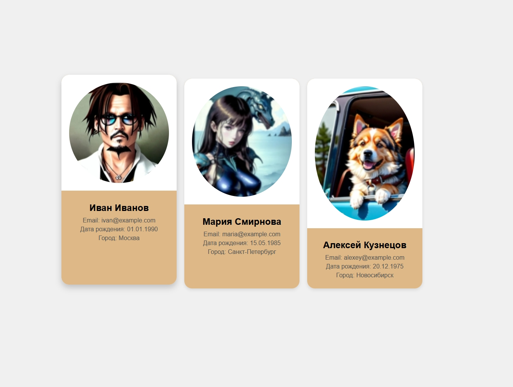

# User Cards

Этот проект демонстрирует создание карточек пользователей с фото, ФИО, e-mail, датой рождения и городом с применением стилей и эффектов при наведении.

## Структура проекта

Проект состоит из следующих файлов:

- `index.html` - основной HTML файл, содержащий структуру карточек пользователей.
- `styles.css` - файл стилей, который определяет внешний вид карточек и эффекты при наведении.

## Скриншот



## Установка и запуск

1. **Склонируйте репозиторий или загрузите архив с проектом:**
    ```sh
    git clone https://github.com/yourusername/user-cards.git
    ```

2. **Перейдите в директорию проекта:**
    ```sh
    cd user-cards
    ```

3. **Откройте файл `index.html` в вашем браузере:**
    - Просто дважды кликните по файлу `index.html` или откройте его с помощью вашего любимого браузера.

## Структура HTML

Файл `index.html` содержит разметку для трех карточек. Каждая карточка включает в себя:

- Блок для фото пользователя.
- Блок с информацией о пользователе: ФИО, e-mail, дата рождения и город.

Пример разметки одной карточки:
```html
<div class="card">
    <div class="photo">
        
    </div>
    <div class="info">
        <h2>Иван Иванов</h2>
        <p>Email: ivan@example.com</p>
        <p>Дата рождения: 01.01.1990</p>
        <p>Город: Москва</p>
    </div>
</div>
```

## Структура CSS

Файл `styles.css` содержит стили для:

- **Тела страницы:** Устанавливает фон, центрирует содержимое и задает шрифт.
- **Контейнера:** Выравнивает карточки в ряд с помощью flexbox.
- **Карточки:** Определяет размеры, фон, тени и эффекты при наведении.
- **Фото:** Центрирует изображение и делает его круглым.
- **Информационного блока:** Определяет стили для текста.

Пример стилей для карточки:
```css
.card {
    width:

300px;
    background-color: burlywood;
    border-radius: 20px;
    overflow: hidden;
    box-shadow: 0 4px 8px rgba(0, 0, 0, 0.1);
    transition: transform 0.3s, box-shadow 0.3s;
}

.card:hover {
    transform: translateY(-10px);
    box-shadow: 0 8px 16px rgba(0, 0, 0, 0.2);
}
```

## Лицензия

Этот проект лицензирован под MIT License - подробности см. в файле LICENSE.
```

